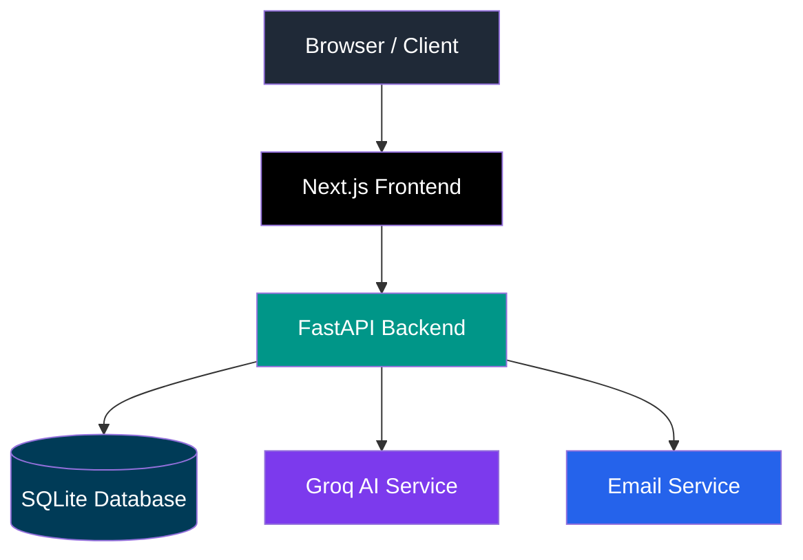
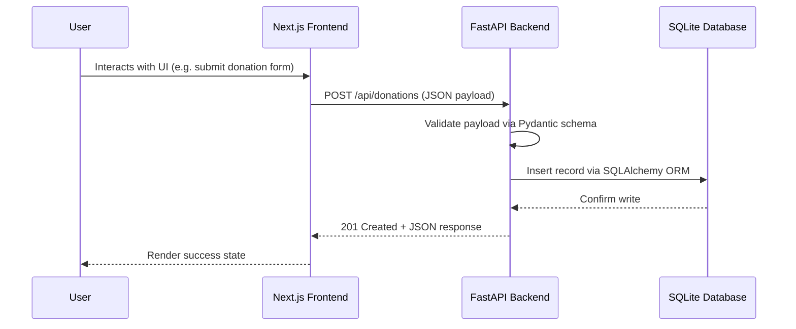
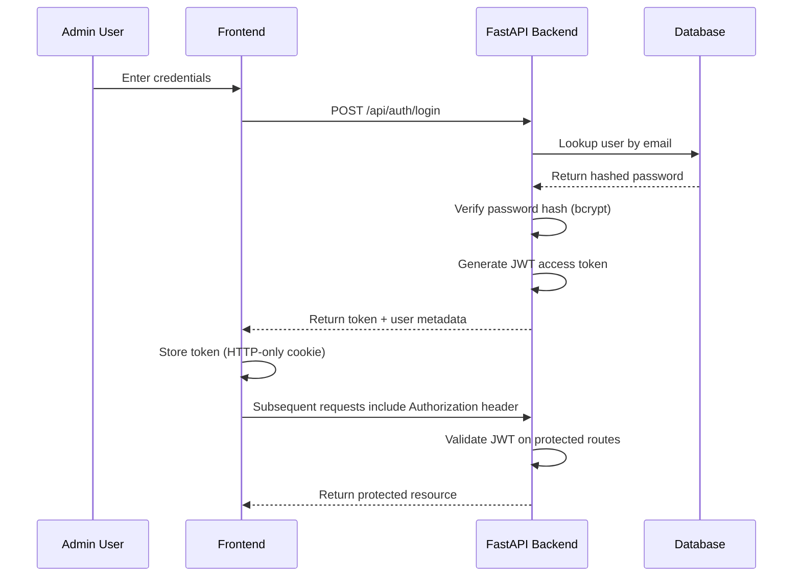
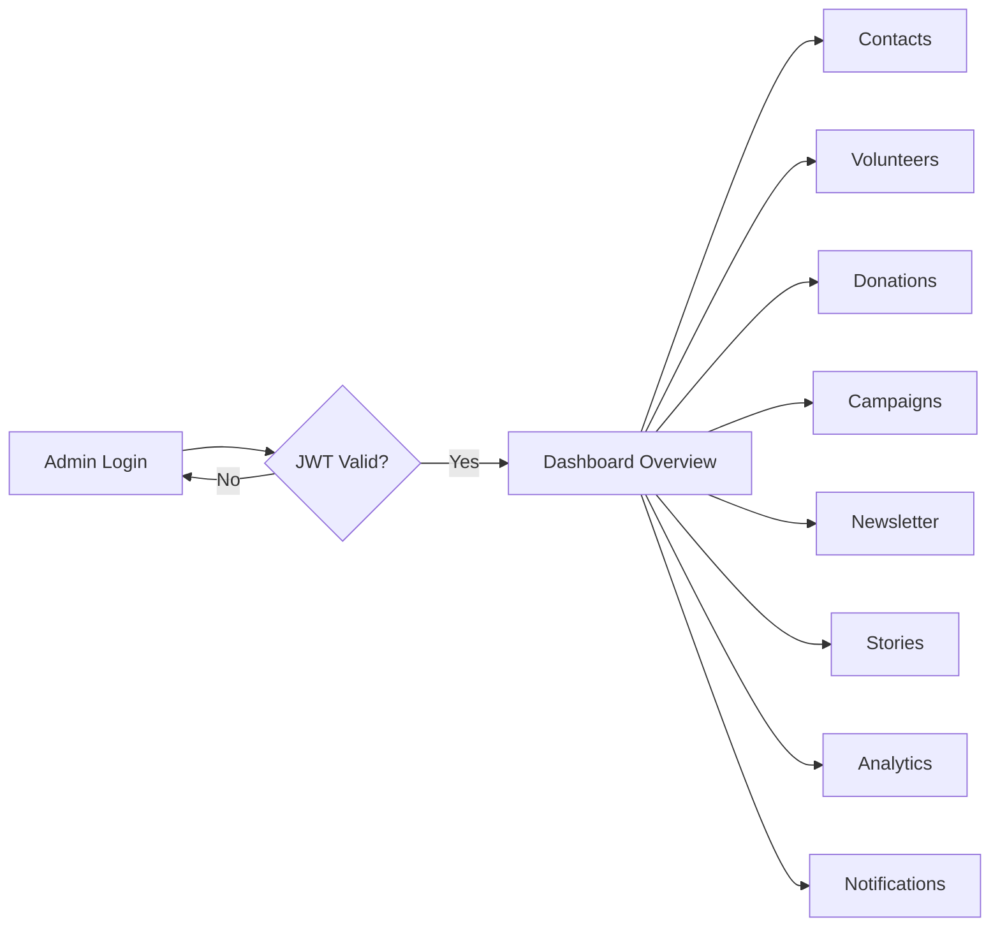
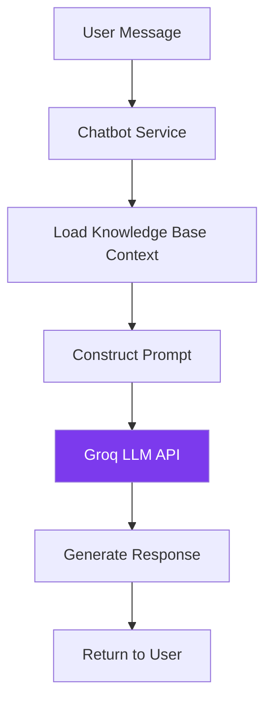
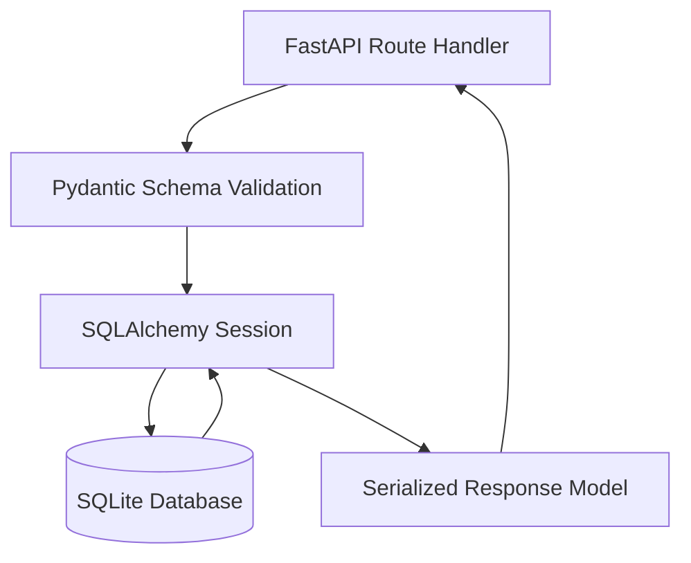
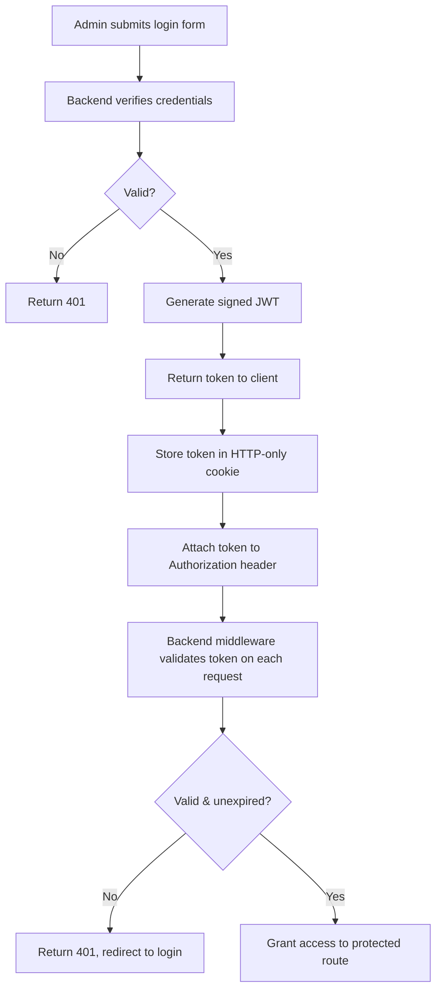
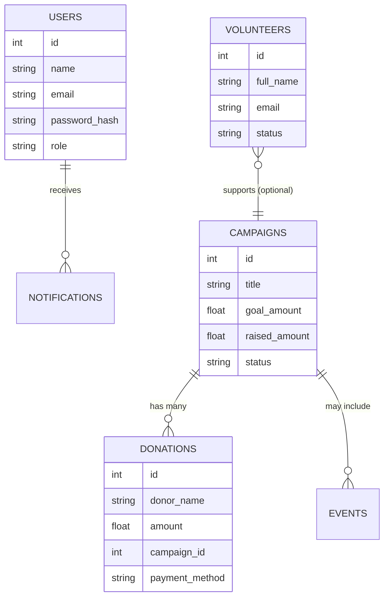
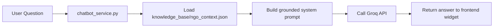
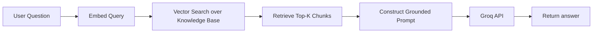

<div align="center">

# Rah-E-Haq

### NGO Management Platform — Public Website & Administrative Dashboard

A full-stack platform for digitizing nonprofit operations: campaigns, donations, volunteers, events, and an AI-assisted knowledge base, built on a modular FastAPI backend and a Next.js frontend.

[](https://nextjs.org/)
[](https://react.dev/)
[](https://fastapi.tiangolo.com/)
[](https://www.python.org/)
[](https://www.sqlite.org/)
[](https://tailwindcss.com/)
[](https://jwt.io/)
[](LICENSE)

[Overview](#project-overview) · [Features](#features) · [Architecture](#architecture) · [API Docs](#api-documentation) · [Installation](#installation) · [Roadmap](#future-roadmap)

</div>

---

## Table of Contents

- [Project Overview](#project-overview)
- [Features](#features)
- [Screenshots](#screenshots)
- [Architecture](#architecture)
- [Folder Structure](#folder-structure)
- [Tech Stack](#tech-stack)
- [API Documentation](#api-documentation)
- [Authentication](#authentication)
- [Database](#database)
- [AI Chatbot](#ai-chatbot)
- [Installation](#installation)
- [Deployment](#deployment)
- [Performance](#performance)
- [Security](#security)
- [Future Roadmap](#future-roadmap)
- [Contributing](#contributing)
- [License](#license)
- [Author](#author)

---

## Project Overview

Most small and mid-sized NGOs in Pakistan run their operations through a scattered mix of spreadsheets, WhatsApp groups, and manual bookkeeping. Donor records live in one place, volunteer sign-ups in another, and campaign progress is tracked informally or not at all. This creates three recurring problems: donors have no transparent way to see where their contributions go, volunteers have no structured onboarding or task visibility, and staff have no single source of truth for reporting to boards or regulators.

**Rah-E-Haq** was built to solve this by providing a unified platform that separates concerns cleanly between a public-facing experience (for donors, volunteers, and visitors) and a private administrative experience (for staff managing day-to-day operations).

### Why this architecture

The project deliberately uses a **decoupled frontend/backend architecture** rather than a monolithic framework like Django templates or a bundled full-stack meta-framework:

- **Next.js (frontend)** is optimized for SEO, fast public-facing pages, and a rich, animated donor experience.
- **FastAPI (backend)** provides a strongly-typed, auto-documented REST API that can later serve additional clients (a mobile app, a partner dashboard) without modification.
- **SQLAlchemy + SQLite** keeps the data layer swappable — the same models can be pointed at PostgreSQL in production with a one-line connection string change.
- **JWT-based authentication** keeps the admin dashboard stateless and horizontally scalable.

This mirrors the architecture patterns used by production SaaS platforms, while remaining lightweight enough to self-host on a modest VPS, which matters for a nonprofit's budget constraints.

### Who this is for

- NGOs and community organizations that need a donation and campaign management system without paying for enterprise nonprofit software.
- Developers looking for a reference implementation of a FastAPI + Next.js full-stack application with JWT auth and an AI chatbot layer.
- Technical reviewers evaluating the author's approach to system design, API design, and frontend architecture.

---

## Features

### Public Platform

| Feature | Description |
|---|---|
| Landing Page | Animated hero section, mission statement, and trust indicators |
| Campaigns | Browse active fundraising campaigns with progress tracking |
| Donations | Donation flow with campaign attribution |
| Events | Public event listings with registration |
| Volunteer Registration | Multi-field volunteer application form |
| Contact Form | Structured contact request submission |
| Newsletter | Email subscription capture |
| Stories / Testimonials | Impact stories from beneficiaries and donors |
| Gallery | Media showcase of NGO activities |
| Zakat Calculator | Interactive nisab-based Zakat calculation tool |

### Admin Dashboard

| Feature | Description |
|---|---|
| Authentication | Secure staff login with JWT sessions |
| Dashboard Overview | Summary metrics across donations, volunteers, and campaigns |
| Contacts Management | View and resolve incoming contact requests |
| Volunteer Management | Review, approve, and track volunteer applications |
| Donation Management | Track and reconcile donation records |
| Campaign Management | Create, edit, and close fundraising campaigns |
| Newsletter Subscribers | Export and manage subscriber lists |
| Stories Management | Publish and moderate testimonials |
| Analytics | Visual reporting on donations and engagement trends |
| Notifications | In-app alerts for new submissions |

### Backend

| Feature | Description |
|---|---|
| REST API | Modular, versioned FastAPI routers |
| JWT Authentication | Access-token based auth with protected routes |
| Database Models | SQLAlchemy ORM models with relational integrity |
| Validation | Pydantic schemas for every request and response |
| Email Service | Transactional email notifications |

### AI

| Feature | Description |
|---|---|
| Chatbot Service | Groq-backed conversational assistant |
| Knowledge Base | Structured NGO-specific context for grounded answers |
| Extensible RAG Path | Architecture designed for future retrieval-augmented generation |

### Security

| Feature | Description |
|---|---|
| Password Hashing | Bcrypt-based credential storage |
| CORS Policy | Restricted cross-origin access |
| Input Validation | Pydantic schema enforcement on every endpoint |
| Protected Routes | Route-level JWT guards on the frontend and backend |

---

## Screenshots

> **Note:** Screenshot assets are not yet embedded in this repository. Replace the placeholders below with actual images from `docs/screenshots/` once captured.

### Homepage

Landing page with hero section, mission overview, and campaign highlights.

`docs/screenshots/homepage.png`

### Campaigns

Public campaign listing with progress bars and category filters.

`docs/screenshots/campaigns.png`

### Donation Page

Donation flow with campaign selection and amount entry.

`docs/screenshots/donation.png`

### Volunteer Page

Volunteer registration form with role and availability fields.

`docs/screenshots/volunteer.png`

### Admin Dashboard

Staff-facing overview panel with key operational metrics.

`docs/screenshots/admin-dashboard.png`

### Analytics

Donation and engagement trend charts for internal reporting.

`docs/screenshots/analytics.png`

### Chatbot

AI assistant answering an organization-related query.

`docs/screenshots/chatbot.png`

### Login

Staff authentication screen with JWT-backed session handling.

`docs/screenshots/login.png`

---

## Architecture

### Overall Architecture



### Request Flow



### Authentication Flow



### Admin Dashboard Flow



### AI Chatbot Flow



### Database Flow



---

## Folder Structure

```
rah-e-haq/
├── backend/
│   ├── app/
│   │   ├── main.py                # FastAPI application entrypoint
│   │   ├── core/
│   │   │   ├── config.py          # Environment configuration
│   │   │   └── security.py        # JWT + password hashing utilities
│   │   ├── models/
│   │   │   ├── user.py            # Admin user ORM model
│   │   │   ├── campaign.py        # Campaign ORM model
│   │   │   ├── donation.py        # Donation ORM model
│   │   │   ├── volunteer.py       # Volunteer ORM model
│   │   │   ├── contact.py         # Contact request ORM model
│   │   │   ├── newsletter.py      # Newsletter subscriber ORM model
│   │   │   └── story.py           # Story / testimonial ORM model
│   │   ├── schemas/
│   │   │   └── ...                # Pydantic request/response schemas
│   │   ├── routes/
│   │   │   ├── auth.py            # Login, token refresh
│   │   │   ├── campaigns.py       # Campaign CRUD
│   │   │   ├── donations.py       # Donation CRUD
│   │   │   ├── volunteers.py      # Volunteer CRUD
│   │   │   ├── contacts.py        # Contact request handling
│   │   │   ├── newsletter.py      # Subscriber management
│   │   │   ├── stories.py         # Story CRUD
│   │   │   ├── analytics.py       # Aggregated reporting endpoints
│   │   │   └── chatbot.py         # AI chatbot endpoint
│   │   ├── services/
│   │   │   ├── email_service.py   # Transactional email logic
│   │   │   └── chatbot_service.py # Groq API integration + knowledge base
│   │   └── database.py            # SQLAlchemy engine/session setup
│   ├── knowledge_base/
│   │   └── ngo_context.json       # Structured context for the chatbot
│   ├── requirements.txt
│   └── .env.example
│
├── frontend/
│   ├── app/
│   │   ├── (public)/
│   │   │   ├── page.tsx           # Landing page
│   │   │   ├── campaigns/
│   │   │   ├── donate/
│   │   │   ├── events/
│   │   │   ├── volunteer/
│   │   │   ├── contact/
│   │   │   └── stories/
│   │   └── admin/
│   │       ├── login/
│   │       ├── dashboard/
│   │       ├── contacts/
│   │       ├── volunteers/
│   │       ├── donations/
│   │       ├── campaigns/
│   │       ├── newsletter/
│   │       ├── stories/
│   │       └── analytics/
│   ├── components/
│   │   ├── ui/                    # Shared UI primitives
│   │   ├── public/                # Public-site components
│   │   └── admin/                 # Dashboard components
│   ├── lib/
│   │   ├── api.ts                 # API client wrapper
│   │   └── auth.ts                # Token storage helpers
│   ├── package.json
│   └── .env.local.example
│
├── docs/
│   └── screenshots/
│
├── LICENSE
└── README.md
```

### Key directories explained

- **`backend/app/models/`** — Each file defines a single SQLAlchemy model, kept intentionally small and single-responsibility rather than one large `models.py`.
- **`backend/app/routes/`** — Routers are registered independently in `main.py`, so any module can be disabled or versioned without touching unrelated code.
- **`backend/app/services/chatbot_service.py`** — Isolates all Groq API interaction and knowledge base loading away from the route layer, making the LLM provider swappable.
- **`frontend/app/(public)/`** — Route group for all unauthenticated pages, kept separate from `admin/` to make the auth boundary explicit in the file system itself.
- **`frontend/lib/api.ts`** — Centralized fetch wrapper that attaches the JWT token and handles 401 redirects, avoiding duplicated auth logic across components.

---

## Tech Stack

### Frontend

| Technology | Purpose |
|---|---|
| Next.js 14 | React framework with App Router, SSR, and file-based routing |
| React 18 | Component-driven UI |
| Tailwind CSS | Utility-first styling |
| Framer Motion | Page and component animations |
| React Icons | Icon library |

### Backend

| Technology | Purpose |
|---|---|
| FastAPI | Async Python web framework with automatic OpenAPI docs |
| Python 3.11 | Core language |
| SQLAlchemy | ORM layer |
| Pydantic | Request/response validation and serialization |

### Database

| Technology | Purpose |
|---|---|
| SQLite | Default local/dev database, file-based |

### Authentication

| Technology | Purpose |
|---|---|
| JWT (PyJWT) | Stateless session tokens |
| Passlib / bcrypt | Password hashing |

### AI

| Technology | Purpose |
|---|---|
| Groq API | Low-latency LLM inference for the chatbot |
| Custom Knowledge Base | Structured JSON context grounding chatbot answers |

### Developer Tools

| Tool | Purpose |
|---|---|
| Uvicorn | ASGI server for FastAPI |
| ESLint / Prettier | Frontend code quality |
| python-dotenv | Environment variable management |

---

## API Documentation

> Base URL (local): `http://localhost:8000/api`
>
> Interactive Swagger docs are auto-generated by FastAPI at `/docs` and ReDoc at `/redoc`.

### Authentication

**`POST /api/auth/login`**

Request:

```json
{
  "email": "admin@rahehaq.org",
  "password": "your-password"
}
```

Response `200 OK`:

```json
{
  "access_token": "eyJhbGciOiJIUzI1NiIsInR5cCI6IkpXVCJ9...",
  "token_type": "bearer",
  "user": {
    "id": 1,
    "name": "Admin User",
    "role": "admin"
  }
}
```

| Status | Meaning |
|---|---|
| 200 | Login successful |
| 401 | Invalid credentials |
| 422 | Validation error (missing/malformed fields) |

---

### Campaigns

**`GET /api/campaigns`**

Response `200 OK`:

```json
[
  {
    "id": 4,
    "title": "Winter Relief Drive",
    "goal_amount": 500000,
    "raised_amount": 210000,
    "status": "active"
  }
]
```

**`POST /api/campaigns`** *(protected)*

Request:

```json
{
  "title": "Clean Water Initiative",
  "description": "Providing clean water access to rural communities.",
  "goal_amount": 750000
}
```

Response `201 Created`:

```json
{
  "id": 5,
  "title": "Clean Water Initiative",
  "status": "active"
}
```

| Status | Meaning |
|---|---|
| 200 | Campaigns retrieved |
| 201 | Campaign created |
| 401 | Missing or invalid token |
| 422 | Validation error |

---

### Volunteers

**`POST /api/volunteers`**

Request:

```json
{
  "full_name": "Ayesha Khan",
  "email": "ayesha@example.com",
  "phone": "+92-300-1234567",
  "area_of_interest": "Event Management"
}
```

Response `201 Created`:

```json
{
  "id": 12,
  "status": "pending_review"
}
```

| Status | Meaning |
|---|---|
| 201 | Volunteer application submitted |
| 422 | Validation error |

---

### Contacts

**`POST /api/contacts`**

Request:

```json
{
  "name": "Bilal Ahmed",
  "email": "bilal@example.com",
  "message": "I would like to know more about your Zakat programs."
}
```

Response `201 Created`:

```json
{
  "id": 33,
  "status": "unresolved"
}
```

---

### Stories

**`GET /api/stories`**

Response `200 OK`:

```json
[
  {
    "id": 2,
    "title": "From Struggle to Stability",
    "author": "Community Beneficiary",
    "published": true
  }
]
```

---

### Newsletter

**`POST /api/newsletter/subscribe`**

Request:

```json
{
  "email": "subscriber@example.com"
}
```

Response `201 Created`:

```json
{
  "message": "Subscribed successfully"
}
```

| Status | Meaning |
|---|---|
| 201 | Subscription created |
| 409 | Email already subscribed |

---

### Donations

**`POST /api/donations`**

Request:

```json
{
  "donor_name": "Anonymous",
  "amount": 5000,
  "campaign_id": 4,
  "payment_method": "bank_transfer"
}
```

Response `201 Created`:

```json
{
  "id": 88,
  "status": "recorded"
}
```

---

### Analytics

**`GET /api/analytics/summary`** *(protected)*

Response `200 OK`:

```json
{
  "total_donations": 1250000,
  "active_campaigns": 6,
  "pending_volunteers": 14,
  "unresolved_contacts": 3
}
```

| Status | Meaning |
|---|---|
| 200 | Summary retrieved |
| 401 | Missing or invalid token |

---

## Authentication

Rah-E-Haq uses stateless **JWT-based authentication** for the admin dashboard. No session state is stored server-side beyond the user record itself, which keeps the backend horizontally scalable.



**Flow summary:**

1. **Login** — Credentials are sent to `/api/auth/login`.
2. **Token generation** — On success, the backend signs a JWT containing the user ID, role, and expiry.
3. **Storage** — The frontend stores the token in an HTTP-only cookie to reduce XSS exposure.
4. **Authorization** — Every protected request includes the token; a FastAPI dependency validates signature and expiry before the route handler runs.
5. **Protected routes** — Both the Next.js middleware (client-side route guarding) and FastAPI dependencies (server-side enforcement) check token validity, so protection is not reliant on the frontend alone.
6. **Logout** — The cookie is cleared client-side and the token is treated as invalid going forward.

> **Note:** Tokens are currently short-lived access tokens without a refresh-token rotation flow. Refresh token support is tracked in the [Future Roadmap](#future-roadmap).

---

## Database

The schema is intentionally normalized around core NGO entities, with foreign keys linking transactional data (donations) back to campaigns.

| Table | Description |
|---|---|
| `users` | Admin/staff accounts with hashed passwords and roles |
| `campaigns` | Fundraising campaigns with goal and raised amounts |
| `donations` | Individual donation records, linked to a campaign |
| `volunteers` | Volunteer applications and status |
| `contacts` | Inbound contact form submissions |
| `newsletter_subscribers` | Email subscriber list |
| `stories` | Published testimonials and impact stories |
| `events` | Public event listings |
| `notifications` | Internal admin notifications |

### Relationships



Data flows from public-facing forms (donations, volunteer applications, contact requests) into the same database consumed by the admin dashboard, so staff see submissions in near real time without a separate sync process.

---

## AI Chatbot

The chatbot is designed to answer visitor questions about the organization — programs, how to donate, how to volunteer — using a grounded knowledge base rather than open-ended generation.

### Components

- **Knowledge Base** — A structured JSON document (`knowledge_base/ngo_context.json`) containing FAQs, program descriptions, and organizational facts.
- **Groq API** — Used for low-latency LLM inference, keeping chatbot response times suitable for a live chat widget.
- **Prompt Construction** — The service loads relevant knowledge base entries and injects them into the system prompt alongside the user's message, constraining the model to organization-specific context.

### Current flow



### Future: Retrieval-Augmented Generation

The current implementation injects the full knowledge base into the prompt, which works at small scale but will not scale as content grows. The architecture is designed so this can be replaced with a proper RAG pipeline without touching the route layer:



This would involve embedding the knowledge base with a sentence-transformer model, storing vectors in a lightweight store (e.g. FAISS), and retrieving only the top-k relevant chunks per query — replacing full-context injection with semantic retrieval.

---

## Installation

### Prerequisites

- Node.js 18+
- Python 3.11+
- npm or yarn

### Backend Setup

```bash
cd backend
python -m venv venv
source venv/bin/activate    # Windows: venv\Scripts\activate

pip install -r requirements.txt

cp .env.example .env
# Edit .env with your GROQ_API_KEY, JWT_SECRET, DATABASE_URL

# Initialize the database
python -m app.database

uvicorn app.main:app --reload --port 8000
```

Backend will be available at `http://localhost:8000`, with interactive docs at `http://localhost:8000/docs`.

### Frontend Setup

```bash
cd frontend
npm install

cp .env.local.example .env.local
# Edit .env.local with NEXT_PUBLIC_API_URL=http://localhost:8000/api

npm run dev
```

Frontend will be available at `http://localhost:3000`.

### Environment Variables

**Backend (`.env`)**

```env
DATABASE_URL=sqlite:///./rahehaq.db
JWT_SECRET=your-secret-key
JWT_ALGORITHM=HS256
JWT_EXPIRE_MINUTES=60
GROQ_API_KEY=your-groq-api-key
EMAIL_HOST=smtp.example.com
EMAIL_USER=notifications@rahehaq.org
EMAIL_PASSWORD=your-email-password
```

**Frontend (`.env.local`)**

```env
NEXT_PUBLIC_API_URL=http://localhost:8000/api
```

---

## Deployment

### Vercel (Frontend)

1. Import the repository into Vercel.
2. Set the root directory to `frontend/`.
3. Add `NEXT_PUBLIC_API_URL` pointing to the deployed backend URL.
4. Deploy — Vercel handles build and SSR hosting automatically.

### Render (Backend)

1. Create a new Web Service pointing to the `backend/` directory.
2. Build command: `pip install -r requirements.txt`
3. Start command: `uvicorn app.main:app --host 0.0.0.0 --port $PORT`
4. Add environment variables from `.env.example`.

### Ubuntu VPS (Self-hosted)

```bash
sudo apt update && sudo apt install python3-venv nginx -y

git clone https://github.com/SaribAzim/rah-e-haq.git
cd rah-e-haq/backend
python3 -m venv venv
source venv/bin/activate
pip install -r requirements.txt

# Run with a process manager
pip install gunicorn
gunicorn app.main:app -w 4 -k uvicorn.workers.UvicornWorker -b 127.0.0.1:8000
```

### Docker

```dockerfile
# backend/Dockerfile
FROM python:3.11-slim
WORKDIR /app
COPY requirements.txt .
RUN pip install --no-cache-dir -r requirements.txt
COPY . .
CMD ["uvicorn", "app.main:app", "--host", "0.0.0.0", "--port", "8000"]
```

```bash
docker build -t rahehaq-backend ./backend
docker run -d -p 8000:8000 --env-file backend/.env rahehaq-backend
```

### Nginx Reverse Proxy

```nginx
server {
    listen 80;
    server_name api.rahehaq.org;

    location / {
        proxy_pass http://127.0.0.1:8000;
        proxy_set_header Host $host;
        proxy_set_header X-Real-IP $remote_addr;
        proxy_set_header X-Forwarded-Proto $scheme;
    }
}
```

> **Tip:** Terminate SSL at Nginx using Certbot (`certbot --nginx`) rather than handling TLS inside the FastAPI application.

---

## Performance

- **Server-Side Rendering (SSR):** Public pages use Next.js SSR/ISR where content changes infrequently (campaigns, stories), reducing client-side load time and improving SEO.
- **Optimized API calls:** The frontend batches related data fetches and avoids redundant calls through a shared API client with response caching where appropriate.
- **Component reuse:** Shared UI primitives (`components/ui/`) are reused across both the public site and admin dashboard, reducing bundle duplication.
- **Code splitting:** Next.js automatically code-splits by route, so the admin dashboard bundle is never shipped to public visitors.
- **Scalability:** The stateless JWT auth model and swappable ORM layer mean the backend can scale horizontally behind a load balancer, and the database can be migrated from SQLite to PostgreSQL without application-layer changes.

---

## Security

| Area | Implementation |
|---|---|
| Authentication | JWT with signed, time-limited tokens |
| Password Storage | Bcrypt hashing, never stored in plaintext |
| Input Validation | Pydantic schemas reject malformed input before it reaches business logic |
| SQL Injection Prevention | SQLAlchemy ORM with parameterized queries; no raw string interpolation |
| CORS | Explicit allow-list of trusted origins |
| Protected Routes | Enforced both client-side (middleware) and server-side (route dependencies) |

> **Warning:** This project currently uses a single long-lived JWT secret and does not implement refresh token rotation or rate limiting. These are tracked in the roadmap below and should be addressed before any production deployment handling real donor data.

### Planned improvements

- Refresh token rotation
- Rate limiting on public endpoints (contact, newsletter, donation forms)
- Role-based access control for multi-admin setups
- Audit logging for sensitive admin actions

---

## Future Roadmap

- [ ] Migrate from SQLite to PostgreSQL for production workloads
- [ ] Introduce Redis for caching and rate limiting
- [ ] Containerize full stack with Docker Compose
- [ ] Set up CI/CD pipeline (GitHub Actions) for automated testing and deployment
- [ ] Integrate a payment gateway for direct online donations
- [ ] Add OCR support for processing scanned donation receipts
- [ ] Automate donor and volunteer email workflows
- [ ] Add cloud storage (S3-compatible) for media and document uploads
- [ ] Implement Role-Based Access Control (RBAC) for multi-tier admin permissions
- [ ] Build an AI document assistant for auto-summarizing reports and grant applications
- [ ] Replace full-context chatbot prompting with a proper RAG pipeline

---

## Contributing

Contributions are welcome. To keep the codebase consistent, please follow this workflow:

1. **Fork** the repository and create your branch from `main`:
   ```bash
   git checkout -b feature/your-feature-name
   ```
2. **Follow existing conventions** — route handlers stay thin, business logic lives in `services/`, and every new endpoint should have a corresponding Pydantic schema.
3. **Write clear commit messages** using the format `type(scope): description`, e.g. `fix(auth): correct token expiry check`.
4. **Test locally** before opening a pull request — ensure both `uvicorn` and `npm run dev` start without errors.
5. **Open a Pull Request** with a clear description of the change and, where relevant, before/after screenshots for UI changes.

> **Note:** For significant architectural changes (e.g. swapping the auth strategy or database), please open an issue first to discuss the approach before submitting a PR.

---

## License

This project is licensed under the **MIT License**. See the [LICENSE](LICENSE) file for details.

---

## Author

<div align="center">

**Syed Sarib Azim**

BS Artificial Intelligence — Air University, Islamabad

[GitHub](https://github.com/SaribAzim) · [LinkedIn](https://linkedin.com/in/sarib-azim-90aa56295/)

</div>

Sarib is a final-year AI student focused on applied machine learning and full-stack systems engineering, with project work spanning fraud detection, medical imaging, NLP, and this NGO management platform. Feedback, issues, and pull requests are welcome.
